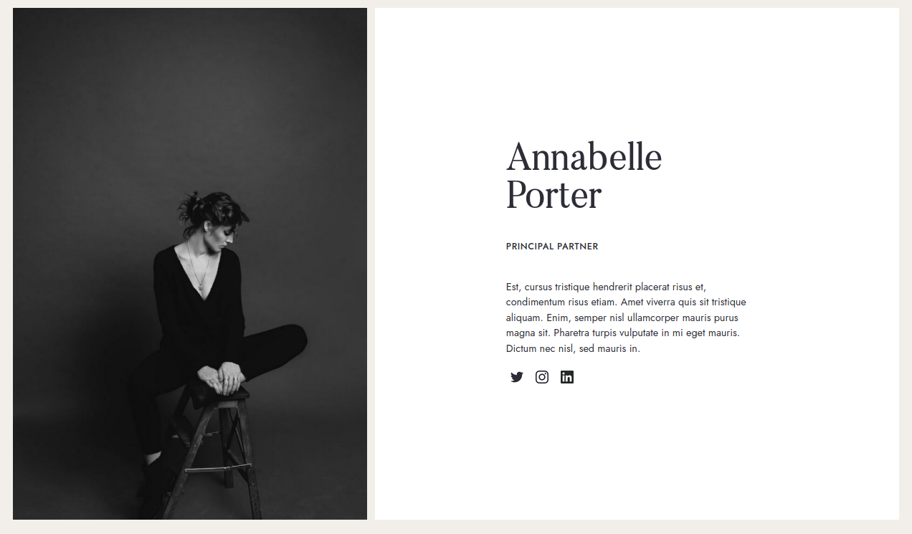

end-of-field-challenge
=====================================

**Becode evaluation challenge**

Exercises:
----------

 - complex.08

 - simple.01

 - simple.04

I chose the complex.08 exercise and the simple.01 exercise.

Complex.08
----------

I did this exercise first.

The final result had to look like this:

My result looks like this (at a certain viewport size):

I first made a version that looks like that at a certain resolution, then made it responsive, and then fintetuned it. i did not use the image overlay pixel perfect technique because the page would scale anyway. I was a bit confused measuring the dimensions because the high resolution picture had huge fonts. I realized it was upscaled. I also didn't find the correct font right away so I found the original article which showed the true font and font size for reference.

I used a flexbox because it had been a while since I used that and this seemed like a good case to use it. I think my solution for responsiveness is not the most elegant - I would personally prefer less lines of code - but it was fast to implement and the result looks good.

Simple.01
----------

The final result had to look like this:

My result looks like this:

This exercise was quite easy to do with the pixel perfect overlay technique. I found a closely matching font so I included it but with a fallback to a webfont as well. I used a grid but since it looks like a card with a fixed width, there were also other options to get the position of the elements right. I am just most comfortable with grids at this point.

Tools used
----------

**Offline**

 - VSCode with the beautify plugin

 - Pinta, a linux tool for image editing

 - The built-in linux Nautilus terminal with Git

 - GRIP app to preview this readme file before committing

 **Online**

 - Github

 - Font squirrel font generator and Font Matcherator

 - DuckDuckGo search engine

 - Google reverse image search

 - Google Fonts